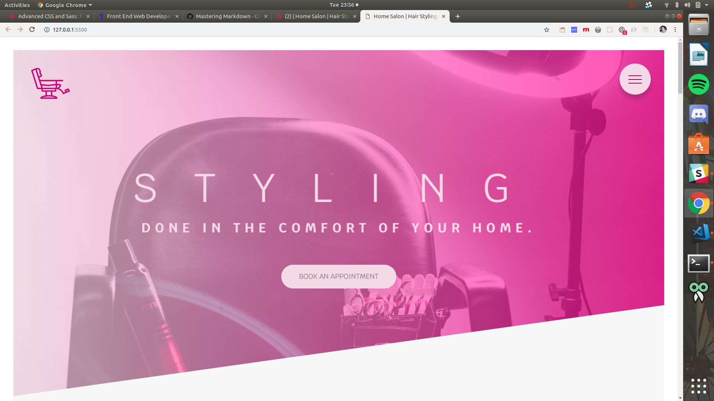
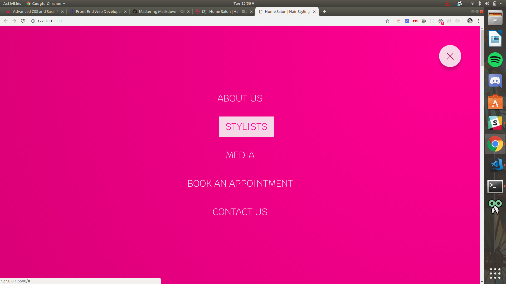
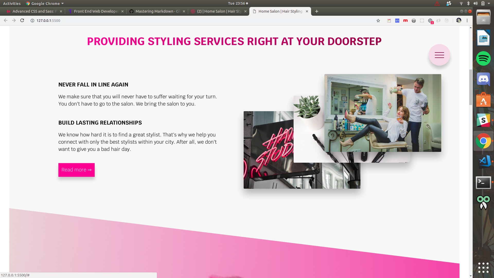
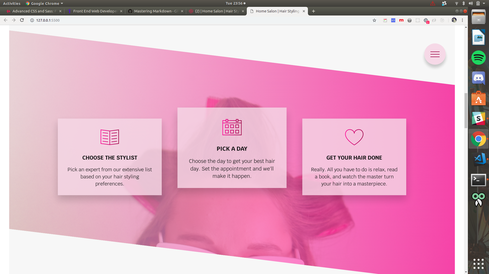
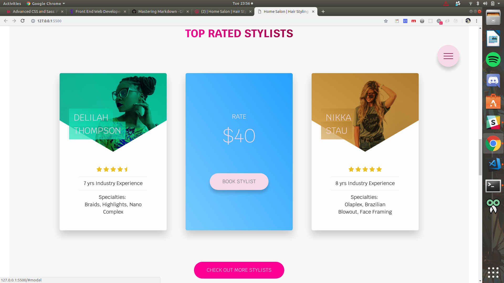
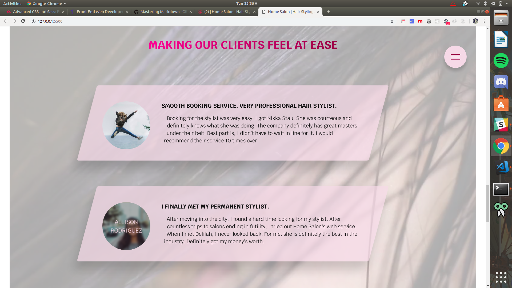
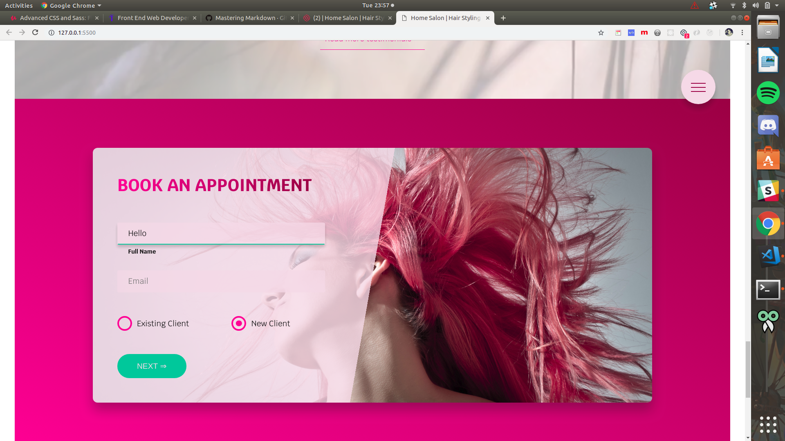
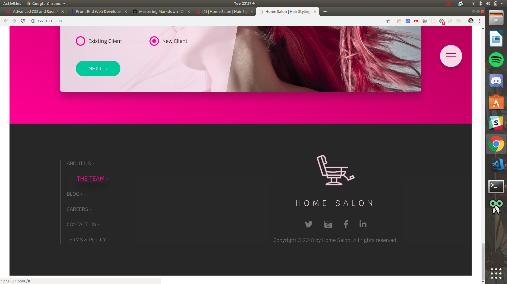

# HOME SALON #

**Home Salon** is a Single-page web application built using SASS, CSS, & HTML. It is designed for a Hair Styling in-call service done at the client's home. 

## Table of Contents ##

1. Project Description
1. Technologies Used
1. Components 
1. Author's Notes 
1. Credits
1. Author 

### Project Description ###

The web app is designed for a myriad of customer types. Someone who recently moved into the city or neighborhood for example would be an ideal candidate. It saves that person the hassle of (1) looking for the perfect stylist, and (2) a salon that is pretty affordable. Another type would be those that just hate waiting for their turn at a salon. You could argue that people can set appointments. Yes, that is true. But there are circumstances that appointments are not really followed to the dot (like emergency cases or if the stylist enjoys the company of that other person more than you).

**Video**

_Please click on the image below to load video of project_

### Technologies Used ###

The following technologies were used to accomplish this project:

* Sass
* npm - needed for sass
* CSS3 
* HTML5

### Components ###

**Header** 
  * Contains the Logo, Hero Image, Hero text, and a call-to-action(cta) button.

**Navigation Button**
  * A fixed navigation button is seen on the top right constantly. It opens up to the Main Navigation Menu.

**About Section**
  * Contains some information the company and on its goals. Has a link to the about page (it is dead for now).

**Features Sections**
  * Displays the main features of the company's web app. 

**Featured Stylists Section**
  * Displays the top rated stylists available for hire. When cards are hovered, it flips to the other side. 

**Client Testimonials Section**
  * Some client testimonials about the company and their app. Also has button to the actual testimonials page (dead for now).

**Booking Form Section**
  * Allows old and new users to book an appointment. Placeholder drops down below the input element when user starts typing. Radio buttons are custom made. Changes color of border-bottom based on validity of input. 

**Footer**
  * Contains some minor site navigation links, logo, social media links, and the copyright. 

### Author's Notes ###

This is a pure SASS, CSS, and HTML mock project. No JavaScript for animations, transitions, transforms, etc. AND yes I rediscovered my appreciation for SASS. 

This project also allowed me to familiarize myself with the 7-1 architecture. It is pretty awesome. It also solidified my knowledge of more advanced CSS styling. 

### Credits ###

**Photos**

* **Hero Photo** by _Shari Sirotnak_ on Unsplash
* **Hairdryer Photo** by _Element5 Digital_ on Unsplash
* **Styling Set Photo** by _Shari Sirotnak_ on Unsplash
* **Salon Photo** by _Cesar Saravia_ on Unsplash
* **Hairstyling Photo** by _Element5 Digital_ on Unsplash
* **Hairstyling 2 Photo** by _Valeria Boltneva_ from Pexels
* **stylist 1 Photo** by _Godisable Jacob_ from Pexels
* **stylist 2 Photo** by _bruce mars_ from Pexels
* **stylist 3 Photo** by _Spencer Selover_ from Pexels
* **user 1 Photo** by _Sebastian Voortman_ from Pexels
* **user 2 Photo** by _Daniel Xavier_ from Pexels
* **Form Photo** by _George Bohunicky_ on Unsplash

**Videos**

* **background-video** by _Pixabay_ from Pexels

### Author ###

_Ruel Alfonso Misa_

